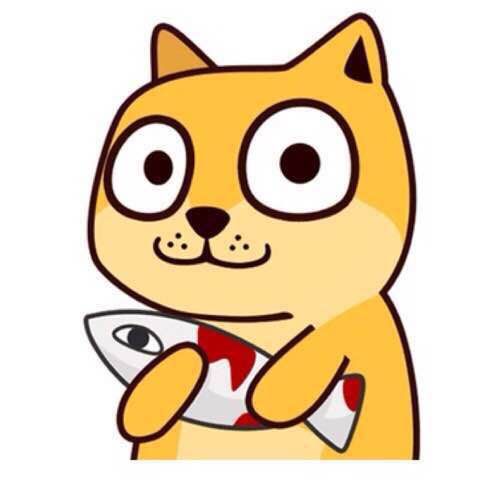

# 我的个人博客 
  欢迎来到酱酱酱酱油鲜技术博客，在这里可以看到网站前端和后端的技术，以及JAVA技术的分享，个人经验经验。

  个人博客采用node.js+Express+Amaze UI，可将自己每日生活中发生的事情记录下来。表达个人思想：它可依照个人自由意志去撰写内容，传达个人的自由思想。分享个人心情：把生活中的不满、郁闷或愤怒宣泄到博客上。

  如果说博客网站是一个舞台，那么所有的博客都是其中的舞者，把自己有价值的真实的一面展示在网络世界中，相互交流沟通；如果博客仅仅为了写日志，那么博客是一面镜子，镜子中展现的是真实的自己；如果博客是一个自由媒体，可以把自身感觉有价值的信息通过博客这个工具发布，与网友共享。
  >感觉在搞一个个人空间
  说白就是搞个人空间 
  不过有考虑加入用户，让其他用户能够评论，在我这里投稿 

## 链接  
  ~~酱酱酱酱油鲜的博客 [www.mbdoge.cn](http://www.mbdoge.cn)~~

## Change log

##### 2016年11月11日
    调整配置文件
    webpack + html-webpack-plugin 多页应用

##### 2016年11月9日
    确定使用页面布局
    修改前端框架，采用bootstrap
    首页导航

> 搬家，装修一下过去3天 时间还真是快啊

##### 2016年11月5日
    部署至开发服务器

##### 2016年11月4日
    创建项目
    项目初始化
    描述文档
    目录划分

## 联系我
Email: [jyx@rpgame.net](jyx@rpgame.net)
